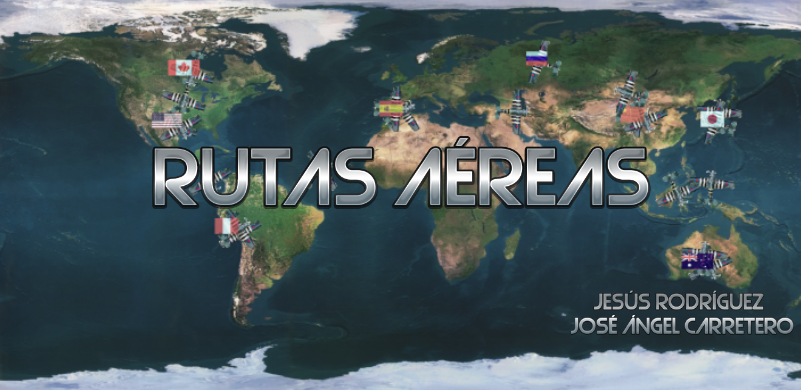
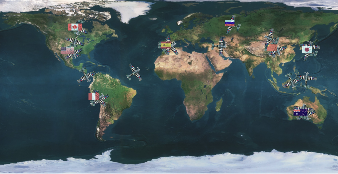
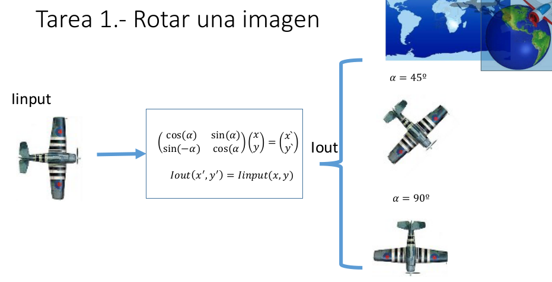
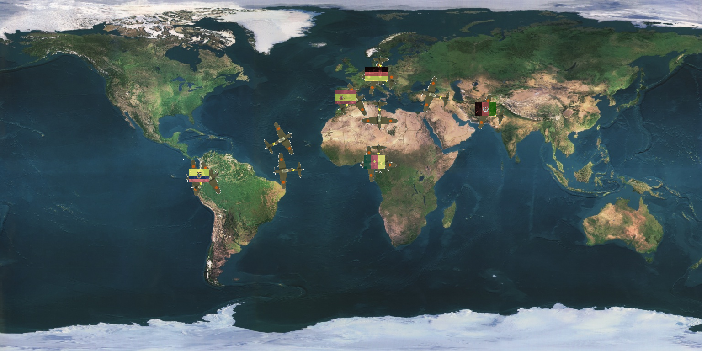

# Practica Final: Rutas Aéreas

<p align="center">
  
</p>

## Introducción

Desarrollamos un software para ayudar a compañías aéreas a visualizar sus rutas sobre los países que atraviesan. La aplicación permite asignar códigos a rutas y muestra en un mapa del mundo las secuencias de países que atraviesa. En pantalla, se presenta una lista de países relevantes, y las banderas de estos se muestran en la ruta. Además, la aplicación marca la ruta con secuencias de aviones.

<p align="center">
  
</p>

## Tareas a realizar

### Tarea 1: Rotar una Imagen

Rotamos imágenes utilizando el módulo Imagen. La fórmula matemática para la rotación se expresa como:

<p align="center">
  
</p>

El programa `pruebarotacion` realiza un ejemplo de rotación de una imagen.

```bash
pruebarotacion <FicheroImagenEntrada> <ÁnguloDeRotación> <FicheroImagenSalida>
```

- `<FicheroImagenEntrada>`: Imagen a rotar
- `<ÁnguloDeRotación>`: Ángulo de rotación en grados
- `<FicheroImagenSalida>`: Imagen rotada de salida

### Tarea 2: Pegar una Imagen

En esta tarea, utilizamos el módulo Imagen para pegar la imagen de un avión sobre el mapa, utilizando una máscara para eliminar el fondo.


El programa `pruebapegado` es un ejemplo de pegado de una imagen sobre otra.

```bash
pruebapegado <FicheroImagenFondo> <FicheroImagenPegar> <FicheroImagenDestino> <FicheroMascara> <Fila> <Columna> <TipoPegado>
```

- `<FichImagenFondo>`: Imagen de fondo sobre la que se pega
- `<FicheroImagenPegar>`: Imagen a pegar sobre el fondo
- `<FicheroImagenDestino>`: Imagen resultante
- `<FicheroMascara>`: Máscara de la imagen a pegar
- `<Fila>`: Fila donde se pega la imagen
- `<Columna>`: Columna donde se pega la imagen
- `<TipoPegado>`: 0 para pegado opaco, 1 para blending

### Tarea 3: Rutas Aéreas
En esta tarea final, se mejora la representación visual de las rutas aéreas en el programa `ruta_aerea.cpp`. Se incorporan imágenes de aviones en la trayectoria de vuelo y se superponen banderas de los países.

#### Descripción de la Tarea

1. **Incorporar una Imagen del Avión en la Trayectoria de Vuelo:**
   - Utilizar la función `Pintar` para pintar la trayectoria del avión entre dos puntos dados en la ruta.
   - Ajustar la función `Pintar` para tener en cuenta la distancia mínima en filas (`mindisf`) y la distancia mínima en columnas (`mindisc`).

2. **Superponer la Badera de Cada País en su Posición Correspondiente:**
   - Obtener las coordenadas en la imagen del mapa para cada país en la ruta.
   - Superponer la bandera del país en la posición calculada en el mapa.

3. **Actualizar la Posición del Avión:**
   - Utilizar la función `Rota` para actualizar la posición del avión de acuerdo con la dirección de vuelo en cada punto de la ruta.

4. **Generar una Imagen Resultante y Guardarla en un Archivo:**
   - Al finalizar la visualización de la ruta seleccionada, generar una imagen resultante que incluya la representación visual de la ruta con avión y banderas.
   - Guardar la imagen en un archivo con el mismo código de la ruta y la extensión ".ppm".

#### Uso del Programa

El programa espera recibir los siguientes parámetros de línea de comandos:

```bash
./ruta_aerea <FicheroPaises> <ImagenMapa> <DirectorioBanderas> <FicheroRutas> <ImagenAvion> <MascaraAvion>
```

- `<FicheroPaises>`: Archivo con la información de los países.
- `<ImagenMapa>`: Nombre de la imagen con el mapa del mundo.
- `<DirectorioBanderas>`: Directorio que contiene las imágenes de las banderas de los países.
- `<FicheroRutas>`: Archivo con el almacenamiento de rutas.
- `<ImagenAvion>`: Nombre de la imagen con la representación del avión.
- `<MascaraAvion>`: Nombre de la imagen de la máscara del avión.

#### Ejemplo de Uso

```bash
./ruta_aerea datos/paises.txt datos/imagenes/mapas/mapa1.ppm datos/imagenes/banderas/ datos/almacen_rutas.txt datos/imagenes/aviones/avion1.ppm datos/imagenes/aviones/mascara_avion1.pgm
```

Esta entrada dará como salida en el terminal la siguiente información:

```plaintext
Las rutas: 
#Rutas
R1 5 (34.5204,69.2008) (52.5079,13.4261) (7.40665,12.3446) (-0.186596,-78.4305) (40.4005,-3.59165) 
R2 8 (58.6954,-96) (35.0869,-103.723) (-12.0553,-77.0452) (40.4005,-3.59165) (37.9438,104.136) (-27.7871,133.281) (35.6735,139.71) (62.8865,61.5512

) 
R3 5 (17.2464,-19.6706) (4.28364,-74.224) (51.5289,-0.101599) (62.8865,61.5512) (37.9438,104.136) 
R4 11 (14.4225,-87.6343) (48.8589,2.34706) (24.7259,46.8225) (58.6954,-96) (35.0869,-103.723) (-12.0553,-77.0452) (40.4005,-3.59165) (37.9438,104.136) (-27.7871,133.281) (35.6735,139.71) (62.8865,61.5512) 
R5 5 (52.7608,8.74761) (-19.0519,29.1528) (-34.6159,-58.4333) (58.6954,-96) (52.7608,8.74761) 

Dime el código de una ruta
R1
Afganistan Alemania Camerun Ecuador Espana 
```

Y generará la siguiente imagen:



Este código proporciona una base para la mejora visual de la representación de rutas aéreas. Asegúrate de contar con las imágenes y archivos necesarios para ejecutar el programa de manera exitosa.

> [!WARNING]
> Este programa presenta una limitación en la lectura de la letra **ñ**. En caso de que la ruta planificada incluya países que contengan 
esta letra, como **España**, podría generar un `segmentation fault`. Por lo tanto, se recomienda evitar que la ruta pase por países con 
esta particularidad o modificar los nombres correspondientes en la imagen de la bandera y en el archivo que almacena las coordenadas de 
los países (`paises.txt`) para evitar posibles problemas.
## Observaciones y Procedimientos

### Compilación del Programa y Generación de Documentación

Para compilar el programa, ejecuta el comando `cmake CMakeLists.txt` en la terminal y, a continuación, ejecuta `make`.

Estos dos pasos proporcionarán todos los ejecutables necesarios, así como la documentación asociada.

> [!TIP]
> **Nota:** Al ejecutar el comando `make`, se generará la documentación en formato HTML con el estilo clásico de Doxygen. Se sugiere, además, ejecutar la orden `doxygen Doxyfile` para aplicar el estilo proporcionado en la carpeta `doc_doxygen`. Esta acción mejora la experiencia del usuario al navegar por la documentación, ofreciendo una presentación más pulida y estructurada.
- **Autores:** José Ángel Carretero, Jesús Rodriguez
- **Fecha:** Diciembre 2023


