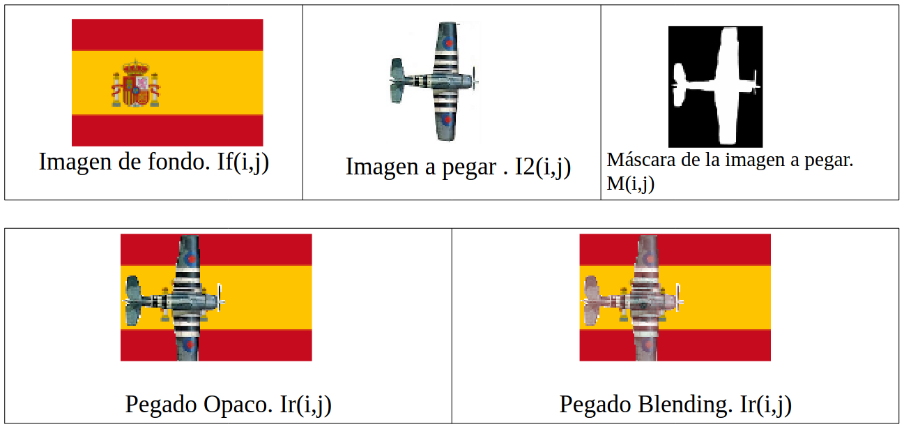

# Practica Final: Rutas Aéreas

<p align="center">
  
</p>

## Introducción

Desarrollamos un software para ayudar a compañías aéreas a visualizar sus rutas sobre los países que atraviesan. La aplicación permite asignar códigos a rutas y muestra en un mapa del mundo las secuencias de países que atraviesa. En pantalla, se presenta una lista de países relevantes, y las banderas de estos se muestran en la ruta. Además, la aplicación marca la ruta con secuencias de aviones.

<p align="center">
  
</p>

## Tareas a realizar

### Tarea 1: Rotar una Imagen

Rotamos imágenes utilizando el módulo Imagen. La fórmula matemática para la rotación se expresa como:

<p align="center">
  
</p>

El programa `pruebarotacion` realiza un ejemplo de rotación de una imagen.

```bash
pruebarotacion <FicheroImagenEntrada> <ÁnguloDeRotación> <FicheroImagenSalida>
```

- `<FicheroImagenEntrada>`: Imagen a rotar
- `<ÁnguloDeRotación>`: Ángulo de rotación en grados
- `<FicheroImagenSalida>`: Imagen rotada de salida

### Tarea 2: Pegar una Imagen

En esta tarea, utilizamos el módulo Imagen para pegar la imagen de un avión sobre el mapa, utilizando una máscara para eliminar el fondo.

<p align="center">
  
</p>

El programa `pruebapegado` es un ejemplo de pegado de una imagen sobre otra.

```bash
pruebapegado <FicheroImagenFondo> <FicheroImagenPegar> <FicheroImagenDestino> <FicheroMascara> <Fila> <Columna> <TipoPegado>
```

- `<FichImagenFondo>`: Imagen de fondo sobre la que se pega
- `<FicheroImagenPegar>`: Imagen a pegar sobre el fondo
- `<FicheroImagenDestino>`: Imagen resultante
- `<FicheroMascara>`: Máscara de la imagen a pegar
- `<Fila>`: Fila donde se pega la imagen
- `<Columna>`: Columna donde se pega la imagen
- `<TipoPegado>`: 0 para pegado opaco, 1 para blending

### Tarea 3: Rutas Aéreas

- **Autores:** José Ángel Carretero, Jesús Rodriguez
- **Fecha:** Diciembre 2023
```
